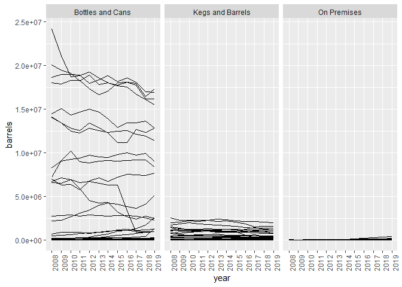
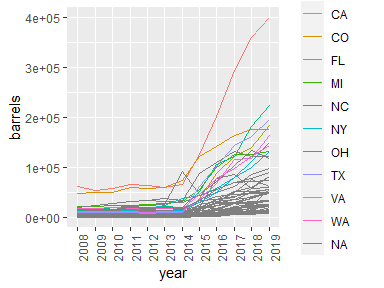
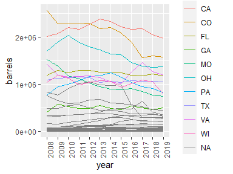
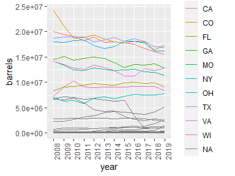
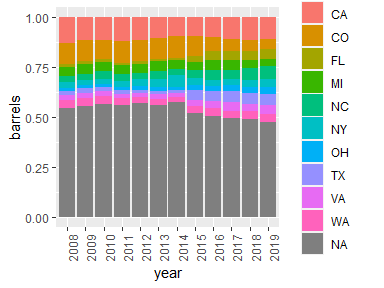
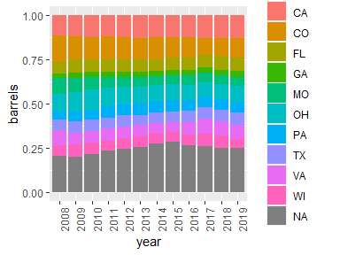
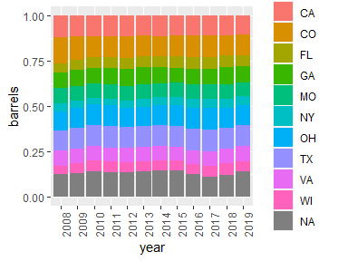

Beer Production by State
================
Heather Turner
2020-04-02

Read in data.

``` r
beer_states <- readr::read_csv('https://raw.githubusercontent.com/rfordatascience/tidytuesday/master/data/2020/2020-03-31/beer_states.csv')
beer_states <- beer_states %>%
  mutate(year = factor(year))
```

Plot production over time for each state, by type of production.

``` r
ggplot(data = filter(beer_states, state != "total"),
       aes(y = barrels, x = year, group = state)) + 
  geom_line() +
  facet_grid(~ type) + 
  theme(axis.text.x = element_text(angle = 90, hjust = 1))
```

<!-- -->

For each type of production, find the 10 states with the highest
production in the last year.

``` r
top10 <- beer_states %>%
  filter(state != "total") %>%
  group_by(type, state) %>%
  summarise(end = last(barrels)) %>%
  arrange(end) %>%
  top_n(10) %>%
  mutate(top10 = TRUE)
```

Merge back in with production data and create a factor of the states,
with NA if the state is not in the top 10.

``` r
beer_states <- left_join(beer_states, select(top10, -end), 
                 by = c("type", "state")) %>%  
  mutate(top10state = ifelse(is.na(top10), NA, state))
```

Use new factor to highlight the top 10 states for each production type.

``` r
ggplot(data = filter(beer_states, state != "total" & type == "On Premises"),
       aes(y = barrels, x = year, group = state, colour = top10state)) + 
  geom_line() + 
  theme(axis.text.x = element_text(angle = 90, hjust = 1))

ggplot(data = filter(beer_states, state != "total" & type == "Kegs and Barrels"),
       aes(y = barrels, x = year, group = state, colour = top10state)) + 
  geom_line() + 
  theme(axis.text.x = element_text(angle = 90, hjust = 1))

ggplot(data = filter(beer_states, state != "total" & type == "Bottles and Cans"),
             aes(y = barrels, x = year, group = state, colour = top10state)) + 
  geom_line() + 
  theme(axis.text.x = element_text(angle = 90, hjust = 1))
```



Similar for stacked bar chart

``` r
ggplot(data = filter(beer_states, state != "total" & type == "On Premises"),
              aes(fill = top10state, y = barrels, x = year)) + 
     geom_bar(position = "fill", stat = "identity") + 
  theme(axis.text.x = element_text(angle = 90, hjust = 1))

ggplot(data = filter(beer_states, state != "total" & type == "Kegs and Barrels"),
              aes(fill = top10state, y = barrels, x = year)) + 
     geom_bar(position = "fill", stat = "identity") + 
  theme(axis.text.x = element_text(angle = 90, hjust = 1))

ggplot(data = filter(beer_states, state != "total" & type == "Bottles and Cans"),
              aes(fill = top10state, y = barrels, x = year)) + 
     geom_bar(position = "fill", stat = "identity") + 
  theme(axis.text.x = element_text(angle = 90, hjust = 1))
```


